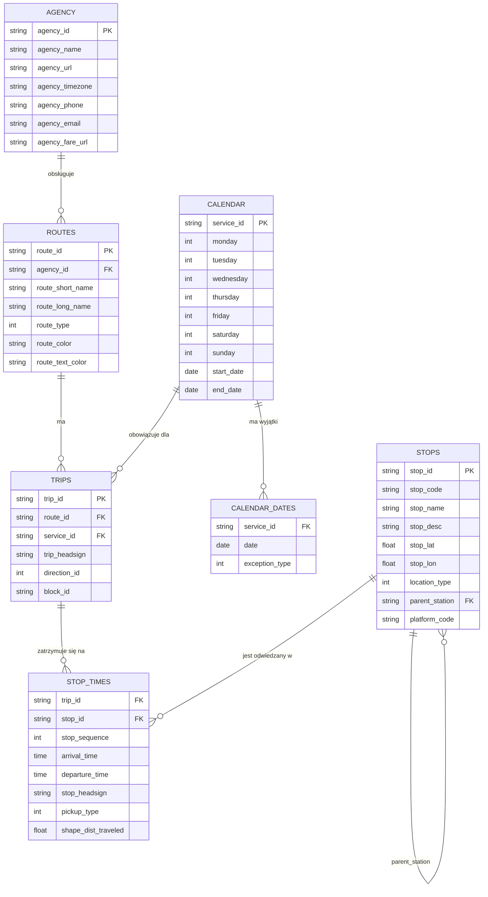

# ERD — GTFS Koleje Dolnośląskie

```mermaid
erDiagram
    AGENCY {
        string agency_id PK
        string agency_name
        string agency_url
        string agency_timezone
        string agency_phone
        string agency_email
        string agency_fare_url
    }

    ROUTES {
        string route_id PK
        string agency_id FK
        string route_short_name
        string route_long_name
        int    route_type
        string route_color
        string route_text_color
    }

    CALENDAR {
        string service_id PK
        int    monday
        int    tuesday
        int    wednesday
        int    thursday
        int    friday
        int    saturday
        int    sunday
        date   start_date
        date   end_date
    }

    CALENDAR_DATES {
        string service_id FK
        date   date
        int    exception_type
    }

    TRIPS {
        string trip_id      PK
        string route_id     FK
        string service_id   FK
        string trip_headsign
        int    direction_id
        string block_id
    }

    STOPS {
        string stop_id       PK
        string stop_code
        string stop_name
        string stop_desc
        float  stop_lat
        float  stop_lon
        int    location_type
        string parent_station FK
        string platform_code
    }

    STOP_TIMES {
        string trip_id          FK
        string stop_id          FK
        int    stop_sequence
        time   arrival_time
        time   departure_time
        string stop_headsign
        int    pickup_type
        float  shape_dist_traveled
    }

    AGENCY       ||--o{ ROUTES        : "obsługuje"
    ROUTES       ||--o{ TRIPS         : "ma"
    CALENDAR     ||--o{ TRIPS         : "obowiązuje dla"
    CALENDAR     ||--o{ CALENDAR_DATES: "ma wyjątki"
    TRIPS        ||--o{ STOP_TIMES    : "zatrzymuje się na"
    STOPS        ||--o{ STOP_TIMES    : "jest odwiedzany w"
    STOPS        ||--o{ STOPS         : "parent_station"
```
